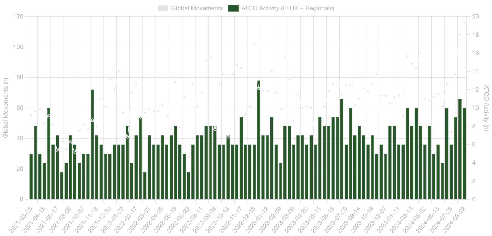
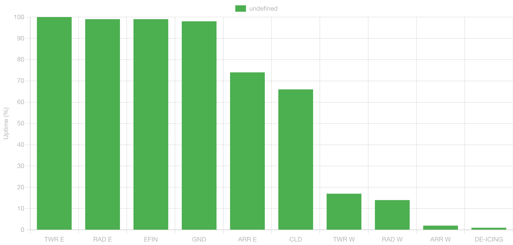

# VATSIM Scandinavia WTH Event Statistics

This Web Application displays interesting statistics for the 'Welcome to HEL' event by VATSIM Scandinavia.

Link to page: https://wth.lusep.fi/ (hosted on Github pages)

## Features

- Choose between showing all-time event data or data from the past 12 months only (rolling year)
- Graph displaying global movements and ATCO activity throughout the event history
- Busiest day indicator showing the total movements and date when the traffic peak was reached
- Graph of departures and arrivals throughout the event history
- Trendline displaying the average traffic growth over time
- peaks in departures and arrivals (which day was the peak reached)
- Average operations trend displaying how many movements are gained per year/month (e.g. +0.6 ops/year)
- Runway configuration usage pie chart
- ATCO activity at Helsinki and at regional aerodromes
- Average traffic count per month (which month is usually busiest?)
Average ATCO count per month (which month has usually the most participants?)

## Screenshots

